# Natural Image Stitching with the Global Similarity Prior

### [[Project page]](http://www.cmlab.csie.ntu.edu.tw/project/stitching-wGSP/) [[Paper]](http://www.cmlab.csie.ntu.edu.tw/project/stitching-wGSP/ECCV-2016-NISwGSP.pdf) [[Supplementary]](http://www.cmlab.csie.ntu.edu.tw/project/stitching-wGSP/ECCV-2016-NISwGSP-supplementary-material.pdf)

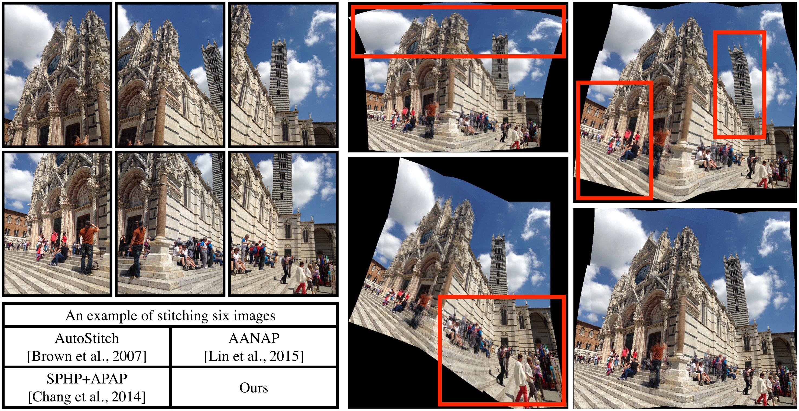

This repository is our C++ implementation of the **ECCV 2016** paper, **Natural Image Stitching with the Global Similarity Prior**. If you use any code or data from our work, please cite our paper.

### Download
1. [Poster](http://www.cmlab.csie.ntu.edu.tw/project/stitching-wGSP/Poster.pdf), [Short Presentation](http://www.cmlab.csie.ntu.edu.tw/project/stitching-wGSP/Short-Presentation.pdf) and [Thesis Presentation](http://www.cmlab.csie.ntu.edu.tw/project/stitching-wGSP/Thesis-Presentation.pdf)
2. [Paper](http://www.cmlab.csie.ntu.edu.tw/project/stitching-wGSP/ECCV-2016-NISwGSP.pdf)
3. [Supplementary](http://www.cmlab.csie.ntu.edu.tw/project/stitching-wGSP/ECCV-2016-NISwGSP-supplementary-material.pdf)
	* We tested four state-of-the-art methods and ours on 42 sets of images in same setting (grid size, feature points and parameters).
4. [Input-42-data](http://www.cmlab.csie.ntu.edu.tw/project/stitching-wGSP/input-42-data.zip)
5. [All our results](http://www.cmlab.csie.ntu.edu.tw/project/stitching-wGSP/0_results.zip)

### Ubuntu Version
If you want to build this project under **Ubuntu**, please refer to https://github.com/Yannnnnnnnnnnn/NISwGSP (Thanks a lot!)

### Usage

1. Download code and compile.
	* You need **Eigen**, **VLFeat**, **OpenCV 3.0.0** and [**OpenMP**](https://github.com/nothinglo/NISwGSP/issues/8) (if you don't need to use omp.h, you can ignore it.)
	* My GCC_VRSION is Apple LLVM 6.0
	```
	GCC_C_LANGUAGE_STANDARD = GNU99 [-std=gnu99]
	CLANG_CXX_LANGUAGE_STANDARD = GNU++14 [-std=gnu++14]
	CLANG_CXX_LIBRARY = libc++ (LLVM C++ standard library with C++11 support)
	```
	* My Eigen version is 3.2.7 (development branch). You need to make sure you can use "LeastSquaresConjugateGradient" class.
	
2. Download [input-42-data](http://www.cmlab.csie.ntu.edu.tw/project/stitching-wGSP/input-42-data.zip). 
	* 42 sets of images: 6 from [1], 3 from [2], 3 from [3], 7 from [4], 4 from [5] and 19 collected by ourselves.
	
3. Move **[input-42-data]** folder to your working directory.
4. Run the command:

	```
	./exe folder_name_in_[input-42-data]_folder
	```
	The results can be found in **[0_results]** folder under **[input-42-data]** folder.

5. Optional:
	* You can control the parameters in **Configure.h** or **xxx-STITCH-GRAPH.txt**

### Results

#### More natural:

<table>
  <tr>
    <th>AutoStitch</th>
    <th>Ours</th> 
    <th>Ours(border)</th>
  </tr>
  <tr>
    <td>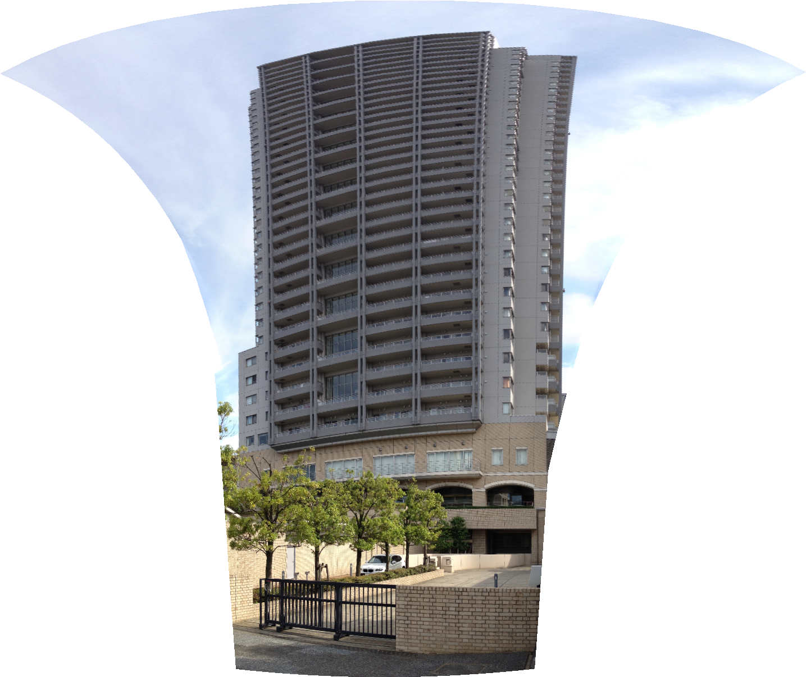</td>
    <td>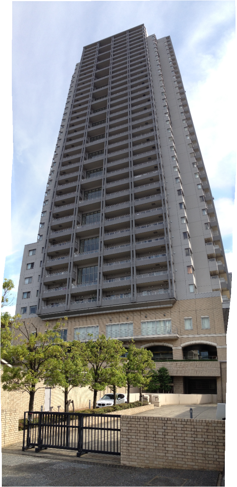</td> 
    <td>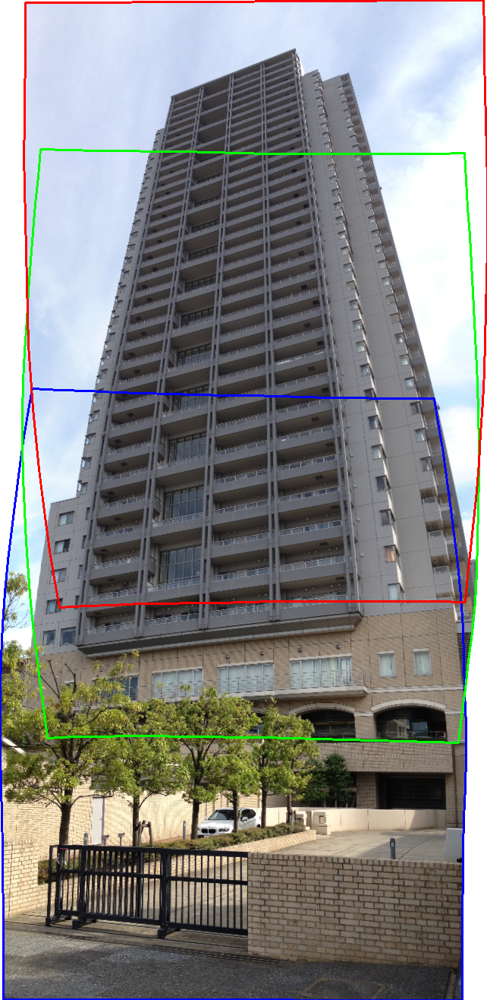</td>
  </tr>
  <tr>
    <td></td>
    <td></td> 
    <td></td>
  </tr>
</table>

<table>
  <tr>
    <th>AutoStitch</th>
    <th>AANAP</th> 
    <th>Ours</th>
  </tr>
  <tr>
    <td width="33%">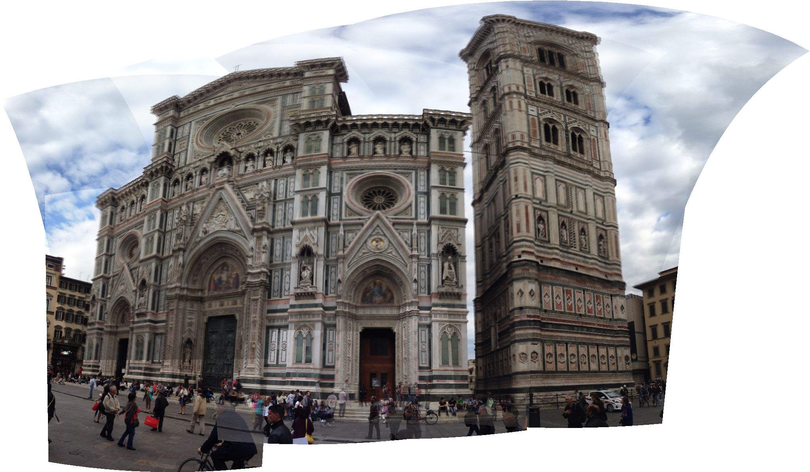</td>
    <td width="33%"></td> 
    <td width="33%">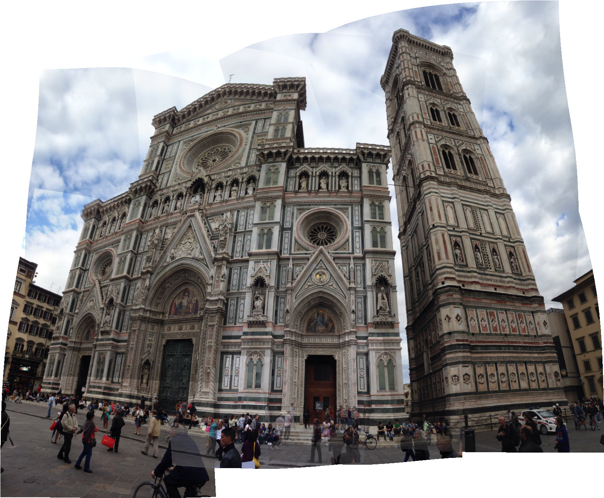</td>
  </tr>
</table>

<table>
  <tr>
    <th>AutoStitch</th>
    <th>AANAP</th> 
  </tr>
  <tr>
    <td width="50%"></td>
    <td width="50%"></td> 
  </tr>
  <tr>
    <th>Ours(2D)</th>
    <th>Ours(3D)</th> 
  </tr>
  <tr>
    <td width="50%"></td>
    <td width="50%"></td> 
  </tr>
</table>

#### Stitching of 20 images:

<table>
  <tr>
    <th>AANAP</th>
    <th>Ours</th> 
  </tr>
  <tr>
    <td width="50%">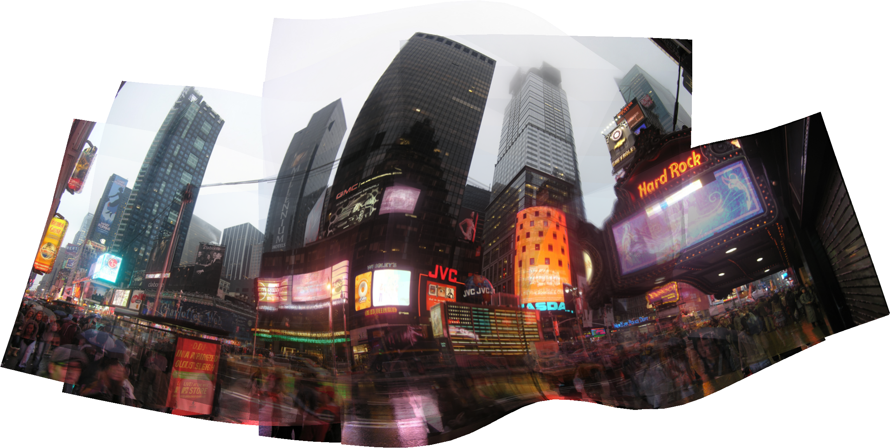</td>
    <td width="50%">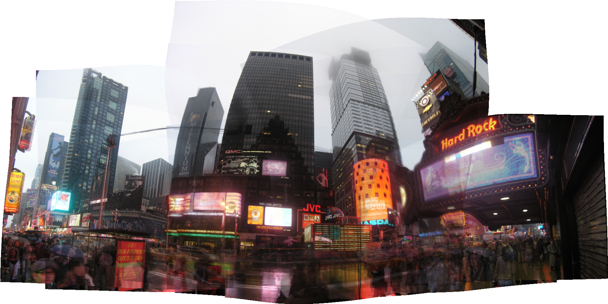</td> 
  </tr>
</table>

#### Stitching of 35 images:

<table>
  <tr>
    <th>AANAP</th>
    <th>Ours(2D)</th> 
    <th>Ours(3D)</th>
  </tr>
  <tr>
    <td width="33%"></td>
    <td width="33%"></td> 
    <td width="33%"></td>
  </tr>
</table>

#### Our method can be used to empower other methods with APAP’s alignment capability:

<table>
  <tr>
    <th>AutoStitch</th>
    <th>AutoStitch + Ours</th> 
    <th>Ours</th>
  </tr>
  <tr>
    <td width="33%">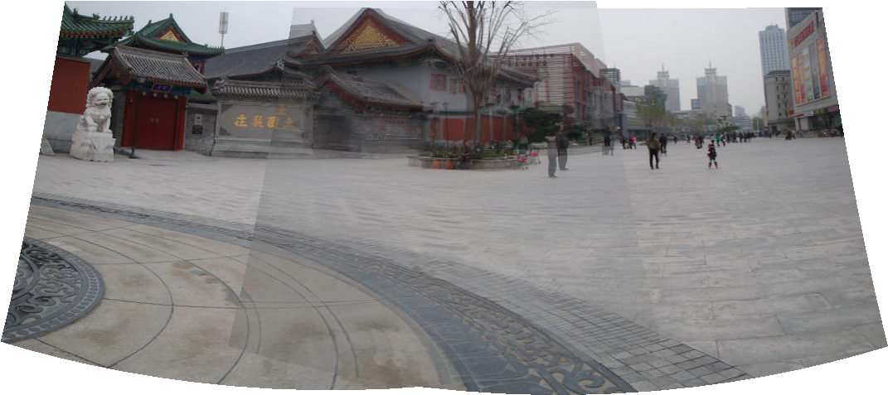</td>
    <td width="33%">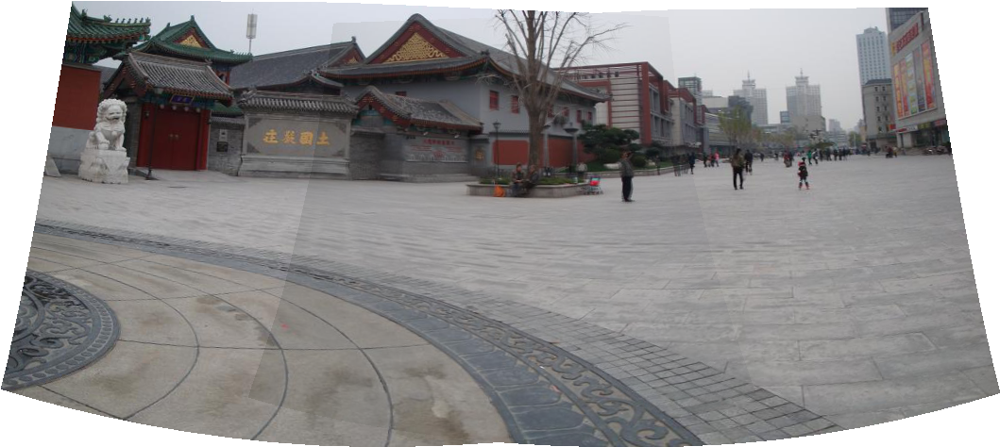</td> 
    <td width="33%">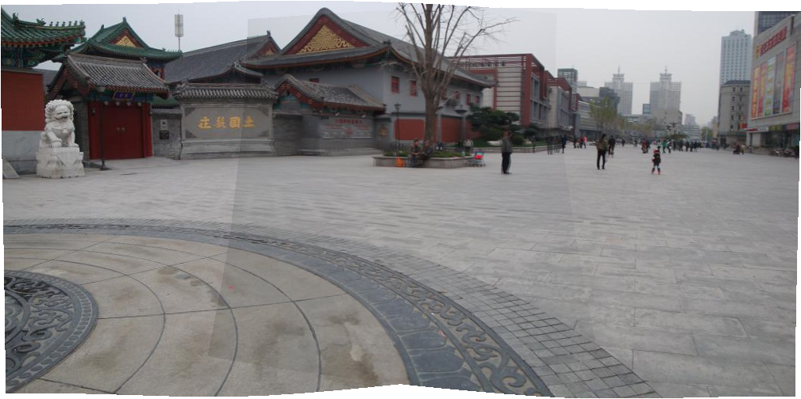</td>
  </tr>
</table>

### Debug mode

You can disable debug mode by adding **NDEBUG** macro. Otherwise you will see the intermediate which is located in the **[1_debugs]** folder under **[input-42-data]**. You can download [all intermediate data](http://www.cmlab.csie.ntu.edu.tw/project/stitching-wGSP/1_debugs.zip). The intermediate example:

<table>
  <tr>
    <th>Border</th>
    <th>Mesh</th> 
  </tr>
  <tr>
    <td>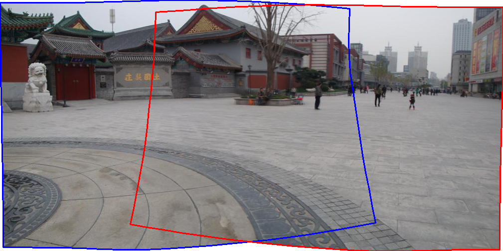</td>
    <td>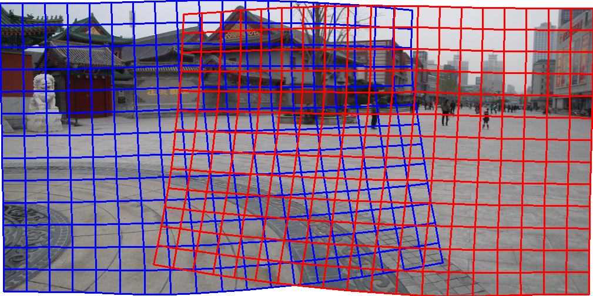</td> 
  </tr>
</table>


<table>
  <tr>
    <th>Initial Features</th>
    <th>After sRANSAC</th> 
  </tr>
  <tr>
    <td>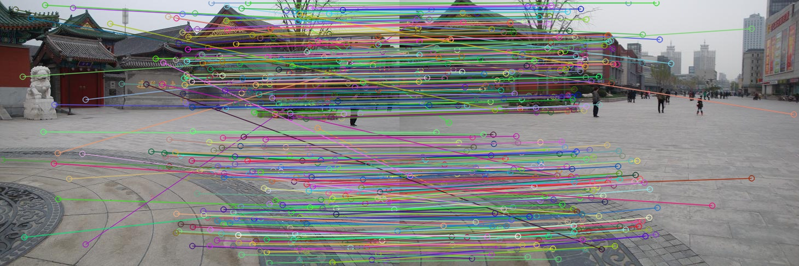</td>
    <td>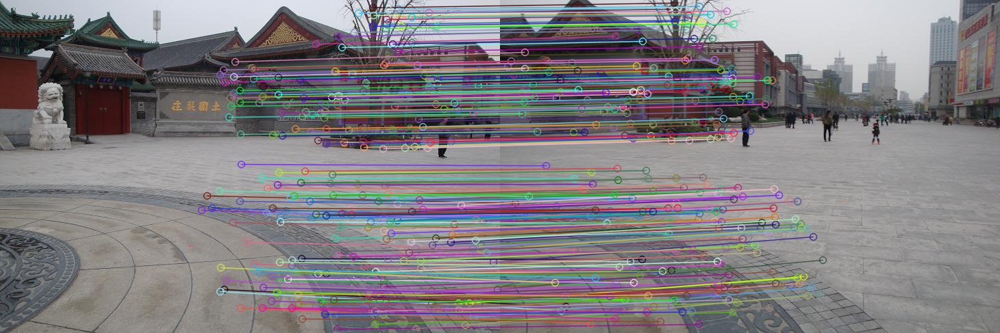</td> 
  </tr>
</table>

<table>
  <tr>
    <th>Line Data 1</th>
    <th>Line Data 2</th> 
  </tr>
  <tr>
    <td>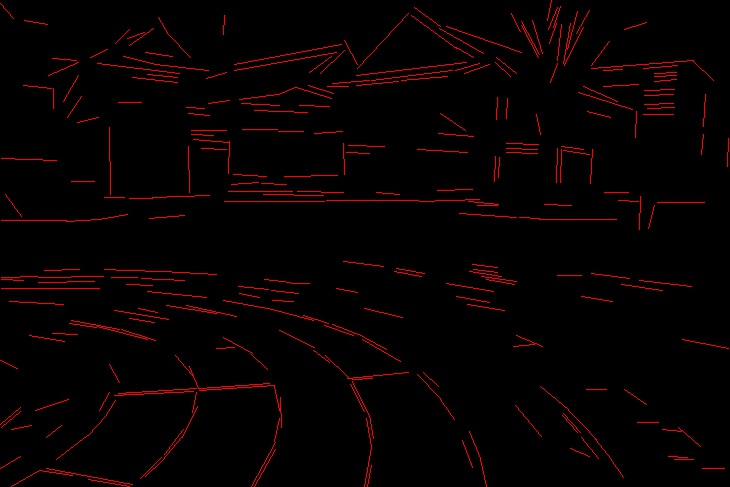</td>
    <td>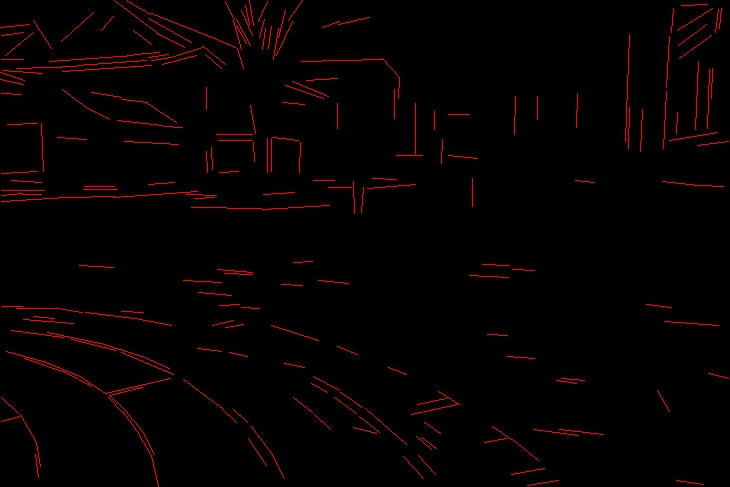</td> 
  </tr>
</table>

### Speed

If you want to speed up, **MATLAB** solver is significantly faster than **Eigen**.

### Publication
[Yu-Sheng Chen](http://www.cmlab.csie.ntu.edu.tw/~nothinglo/) and [Yung-Yu Chuang](http://www.csie.ntu.edu.tw/~cyy/).

[National Taiwan University](http://www.ntu.edu.tw)

Natural Image Stitching with Global Similarity Prior. 
Proceedings of European Conference on Computer Vision 2016 (ECCV 2016), Part V, pp. 186-201, October 2016, Amsterdam, Netherland.

### Citation
```
@INPROCEEDINGS{Chen:2016:NIS,
	AUTHOR		= {Yu-Sheng Chen and Yung-Yu Chuang},
	TITLE		= {Natural Image Stitching with the Global Similarity Prior}, 
	YEAR		= {2016},
	MONTH		= {October},
	BOOKTITLE	= {Proceedings of European Conference on Computer Vision (ECCV 2016)},
	PAGES		= {V186--201},
	LOCATION	= {Amsterdam},
}
```
### Reference

> 1. *Chang, C.H., Sato, Y., Chuang, Y.Y.: Shape-preserving half-projective warps for image stitching. In: Proceedings of the 2014 IEEE Conference on Computer Vision and Pattern Recognition. pp. 3254-3261. CVPR'14 (2014)*
> 2. *Gao, J., Kim, S.J., Brown, M.S.: Constructing image panoramas using dual-homography warping. In: Proceedings of the 2011 IEEE Conference on Computer Vision and Pattern Recognition. pp. 49-56. CVPR'11 (2011)*
> 3. *Lin, C., Pankanti, S., Ramamurthy, K.N., Aravkin, A.Y.: Adaptive as-natural-as-possible image stitching. In: IEEE Conference on Computer Vision and Pattern Recognition, CVPR 2015, Boston, MA, USA, June 7-12, 2015. pp. 1155-1163 (2015)*
> 4. *Nomura, Y., Zhang, L., Nayar, S.K.: Scene collages and flexible camera arrays. In: Proceedings of the 18th Eurographics Conference on Rendering Techniques. pp. 127-138. EGSR'07 (2007)*
> 5. *Zaragoza, J., Chin, T.J., Brown, M.S., Suter, D.: As-projective-as-possible image stitching with moving dlt. In: Proceedings of the 2013 IEEE Conference on Computer Vision and Pattern Recognition. pp. 2339-2346. CVPR'13 (2013)*

### Contact
Feel free to contact me if there is any question (Yu-Sheng Chen nothinglo@cmlab.csie.ntu.edu.tw).
